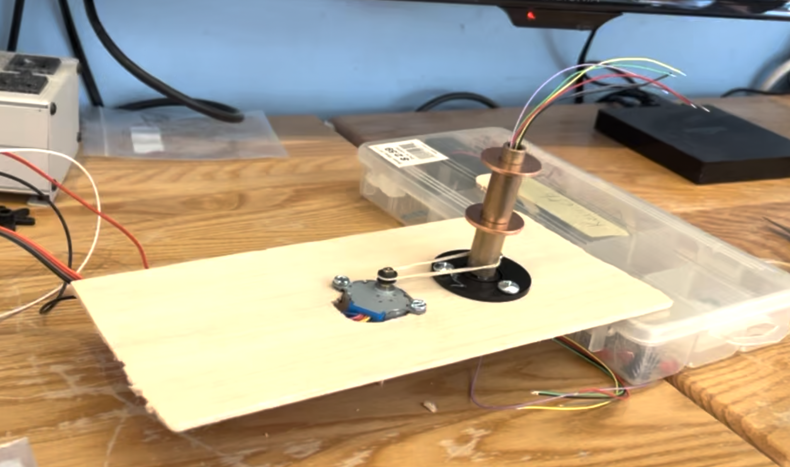

# ECE 350 Final Project Proposal
# Embedded Ultrasonic Sonar Vizualizer
## Ethan Horowtiz, Ken Kalin

### Overview:

This project aims to build a sonar/radar system that used a VGA display and scanning sensor to develop a radar image of the systems surrounding using the FPGA board, ultrasonic sensor, a motor. 


*Example Radar System Display*


### Computational Complexity/ CPU Modifications:

#### Ultrasonic Sensor Integration:

The ultrasonic sensor provides distance measurements based on the time it takes for an ultrasonic pulse to travel to an object and back. Integrating this sensor with the FPGA board and CPU involves handling timing accurately.

##### Ultrasonic Sensor Pins:

The ultrasonic sensor typically has four pins: 5V, GND, Trig, and Echo.

- **Trig Pin**: This pin triggers the ultrasonic pulse.
- **Echo Pin**: This pin goes high when the ultrasonic pulse is sent and remains high until the echo is received back.

##### Needed CPU Modifications:

To integrate the ultrasonic sensor with the FPGA CPU, the following modifications are necessary:

1. **Microsecond Counter**: Implement a counter that counts in microseconds. This can be achieved by adding flip-flops to scale down the clock speed and store the count in a register. This counter will be used to measure the time intervals accurately.

2. **Reading Current Time**: Add a CPU operation to read from the special register holding the current time in milliseconds. This operation will provide a timestamp for various events.

3. **Distance Calculation**:
   - When the Trig pin goes high, store the current time in the register.
   - When the Echo pin goes low (indicating echo received), store the current time again.
   - Calculate the time difference between the start and end times, and multiply it by the speed of sound to obtain the distance to the object. This distance will be used to determine the position of objects on the display.

#### Operating Stepper Motor:

The stepper motor is responsible for rotating the ultrasonic sensor to scan its surroundings. The control involves toggling specific coil sequences to move the motor accurately.

- **Stepper Motor Pins**: The stepper motor typically has four input pins corresponding to coils (A, B, C, D), in addition to power and ground.

##### Needed CPU Modifications:

To control the stepper motor with the FPGA CPU, the following modifications are needed:

1. **Stepper Motor Sequence**: Define a sequence of coil activations to turn the motor in a desired direction. This sequence involves toggling the coils in a specific order.

2. **Motor Control Logic**: Implement logic to drive the stepper motor based on the defined sequence. This logic should ensure accurate movement and positioning of the motor.

3. **Speed Control**: Optionally, implement speed control logic to adjust the speed of the motor as needed.

#### Fixed Point Math:

Fixed-point math is essential for efficient trigonometric calculations and distance measurements.

- **Trigonometric Calculations**: Use fixed-point representations and lookup tables to perform trigonometric calculations efficiently.

- **Distance Calculation**: Utilize fixed-point arithmetic to multiply the delay time by the speed of sound to obtain distances accurately in centimeters.

#### Plotting Distances using Frame Buffer:

To visualize the surroundings on the VGA display, distances obtained from the ultrasonic sensor need to be plotted accurately.

- **Coordinate Calculation**: Use lookup tables to find the offsets for distances at each angle. This information will be used to plot objects on the screen.

- **Frame Buffer**: Implement logic to update the frame buffer with distance information for each angle. After completing a full sweep, reset the frame buffer to prepare for the next scan.

### Edge Cases:

- **No Object Detected**: Determine a timeout mechanism for cases where no object is detected within a certain time frame.
- **Counter Rollover**: Handle the rollover of the microsecond counter, which may occur approximately every 4,294,967,295 milliseconds, to avoid inaccuracies in time measurements.


### Checkpoints and MVP:


**Minimum Viable Product "Parking Sensor"**

The first part of the project will involve writing code to recieve data from the ultrasonic sensor in one direction (without the motor). 

#### Using ultraosonic sensor:


**Sonar System with Rotating Sensor**

Spining the sensor and plotting the distances on a coordinate system complicates the system for a number of reasons

* More complicated physical design to support the rotating sensor and move the motor precisely to keep the expected position of the sensor in sync with its true position
* Plotting the distances on the screen around the origin where the distance is represented as a point at the radius of a circle requires trigonometry to find the correct location in the frame buffer to update


### Physical Design


#### Parts Needed:


Slip-Ring:


* A [slip ring](https://www.adafruit.com/product/736 ) is a bearing that connects wires through a rotating interface. This will enable the ultrasonic sensor to spin with full freedom without tangling or breaking the wires. The other side of the slip ring can be connected to the circuitry

Stepper Motor / Controler Board:


* To precicesly move the ultrasonic sensor a small amount between each "sensing" a stepper motor will be used to rotate the motor a consistent number of steps
* A stepper motor operates by toggling magnetic coils in a specific sequence to turn the rotor of the motor to stable position.


#### Motor Operation

A 5v [28YBJ-48 Stepper Motor](https://arduinoinfo.mywikis.net/wiki/SmallSteppers) is used which includes a motor controller board with 4 input pins in addition to power and ground. Each of these 4 input wires correspond to one of the coils (A,B,C,D) in the motor. To turn the motor the coils must be toggled in a specific sequence of pairs to walk the motor in a direction. (Turning on the wrong sequence of coils will cause the motor to shutter and shake).

To turn the motor counter-clockwise:
4 Step Sequence: AB-BC-CD-DA

```
const byte stepSequence4[4] = {
  B1100, // Step A: AB
  B0110, // Step B: BC
  B0011, // Step C: CD
  B1001  // Step D: DA
};
```

To speed up the motor, the pair sequence can be sped up. 


The Motor control desing using a belt to spin the slip ring was prototyped using an Arduino to drive the setpper motor (without using built in stepper library). The motor was driven using a REDDuino which can run at 3.3 and 5V. The motor worked at 3.3V (although it was slower), so it may need to be driven at 5V using level matching since the FPGA driven pins are a 3.3V




### Schedule:

| Week      | Description |
| ----------- | ----------- |
| 1 | Add memory remapping to IO pins for processor, set up basic physical example with Arduino interfacing with stepper and ultrasonic sensor |
| 2 | Add VGA support, display radar background image on screen, figure out how to plot pixel on display, design enclosure / prototype |
| 3 | Write protocols for reading ultrasonic sensor and stepper motor in assembly, test on FPGA, start putting together final enclosure |
| 4 | Complete integration of display, sensor reading, and motor stepping, finish final enclosure |